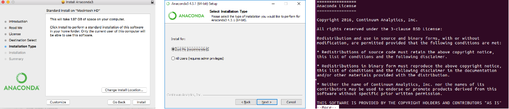

# Installation Instructions

TensorFlow is a software library for Machine Learning developed by Google 
(created in 2015). Although it is primarily used in Python, APIs for C++, Java
(among others) also exist. It gets its name from the fact that a *tensor* is 
a multi-dimensional array (the *n*-dimensional generalization of a matrix)!  
  
If you have experience installing Python packages, simply follow the official
TensorFlow instructions [here](https://www.tensorflow.org/install/).

## Installing Python

The recommended way to install Python is through Anaconda, 
which conveniently installs Python and many packages that are
commonly used in data science. 

1. Go to the Anaconda [website](https://www.anaconda.com/download/)
and Download the Python 3.6 version for your operating system.


2. Find the downloaded files (probably in your Downloads folder)
    
**Mac**: Double click the `.pkg` file  
**Windows**: Double click the `.exe` file  
**Linux**: In the terminal, run `bash Anaconda*.sh`
    
Follow the prompts on the installation screen/terminal prompt.
If at any time you are unsure about settings, just accept the
defaults (these can always be changed later).  
Depending on your operating system, you should see something
similar to one of the following:


3. (Optional) Test your installation
    
**Mac/Linux**: Open a terminal and run `conda list`  
**Windows**: Open the Anaconda Prompt and run `conda list`
  
If a list of installed packages appears (or anything other
than an error), you are good to go!  
  
## Installing Git

Git is a version control system - GitHub is a website that hosts
version control services, and it is where we keep all course material.

**Mac**:   
* To find out if you already have git installed, open
a terminal and type `git -- version`. If you see `git version x.x`,
then you already have git.  
1. If you do not already have git, download the latest 
[Git for Mac installer](https://sourceforge.net/projects/git-osx-installer/files/)
and follow the installation prompts.   
2. Run `git clone https://github.com/CornellDataScience/Deep-Learning-Course.git`
to download all course material.  
 When complete, run the clone command given above.
  
**Windows**:  
* To find out if you already have git installed, open a command prompt
(by going to `Windows -> cmd -> run`) and type in `git --version`.  
If you see `git version x.x`, you already have git.  

(Option 1 - easier but less flexible)  
1. Install [GitHub Desktop](https://desktop.github.com/)
2. Go to `File -> Clone a Repository` and paste in this link:
`https://github.com/CornellDataScience/Deep-Learning-Course.git`

(Option 2 - slightly harder but more flexible)  
1. Download the latest [Git for Windows installer](https://gitforwindows.org/),
and follow the installation prompts.
2. Open a command prompt, and run `git clone https://github.com/CornellDataScience/Deep-Learning-Course.git`
to download all course material.


**Linux**: 
1. In the terminal, run `sudo apt-get install git` 
(you will be prompted for your password) 
2. Then run `git clone https://github.com/CornellDataScience/Deep-Learning-Course.git`


Alternatively, you may choose to download all materials in a zip
file by clicking the green "Clone or download" button in the upper
right corner and clicking "Download ZIP". However, this means
that you will have to download a new zip file every time course
material is updated!


## Installing TensorFlow

Open a terminal (**Mac/Linux**) or the Anaconda prompt
 (**Windows/Mac**)and type: 
```bash
pip install --ignore-installed --upgrade tensorflow
```
If you have a GPU, use:
```bash
pip install --ignore-installed --upgrade tensorflow-gpu 
``` 
To validate your installation, invoke python from your shell by typing:
```bash
python
```
Type the following short program line-by-line into your shell:
```python
import tensorflow as tf
hello = tf.constant('Hello, TensorFlow!')
sess = tf.Session()
print(sess.run(hello))
```
This should output:
```
Hello, TensorFlow!
```
