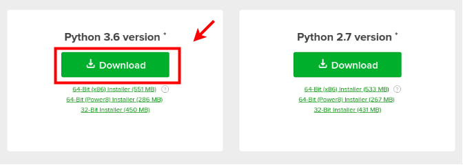

# Installation Instructions

TensorFlow is a software library for Machine Learning developed by Google 
(created in 2015). Although it is primarily used in Python, APIs for C++, Java
(among others) also exist. It gets its name from the fact that a *tensor* is 
a multi-dimensional array (the *n*-dimensional generalization of a matrix)!  
  
If you have experience installing Python packages, simply follow the official
TensorFlow instructions [here](https://www.tensorflow.org/install/).

## Installing Python

The recommended way to install Python is through Anaconda, 
which conveniently installs Python and many packages that are
commonly used in data science. 

1. Go to the Anaconda [website](https://www.anaconda.com/download/)
and Download the Python 3.6 version for your operating system.

2. Find the downloaded files (probably your Downloads folder)  
**Mac**: Double click the `.pkg` file  
**Windows**: Double click the `.exe` file  
**Linux**: In the terminal, run `bash Anaconda*.sh`  
Follow the prompts on the installation screen/terminal prompt.
If at any time you are unsure about settings, just accept the
defaults (these can always be changed later).  
Depending on your operating system, you should see something
similar to one of the following:

3. (Optional) Test your installation  
**Mac/Linux**: Open a terminal and run `conda list`  
**Windows**: Open the Anaconda Prompt and run `conda list`  
If a list of installed packages appears (or anything other
than an error), you are good to go!  
  
## Installing Git  