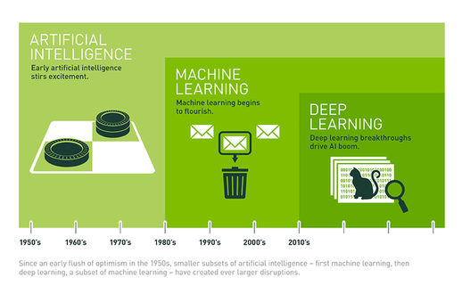
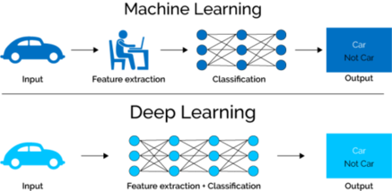

# Linear Classifiers

This tutorial introduces the fundamental concepts of machine learning,
and implements a linear classifier in TensorFlow. Once you understand
a linear classifier, a deep neural network is simply parallelism and 
recursion! Even if you are already familiar with linear classification,
it is important to understand it from the perspective of optimization,
and its implementation in TensorFlow.

## What is Deep Learning?

Deep learning is a subfield of machine learning, which in turn 
is a subfield of artificial intelligence. Artificial intelligence
refers broadly to any system that accomplishes a task typically done
by humans - at its most basic level, this includes something as 
simple as a calculator. 

Whereas traditional AI may require a person
to manually code a series of decision rules, machine learning seeks to
automate that process: machine learning algorithms learn the most
effective decision rules from a dataset. This has proven wildly 
successful:   
TODO: example

However, a limitation of traditional machine learning is that they
require human intervention to extract useful features from the data.
Deep learning aims to automate this (mathematically speaking, this
is done by learning adaptive basis functions) and implement an 
end-to-end system from data to predictions.

Applications of deep learning are everywhere these days and you
are likely familiar with many of them. They include voice assistants
such as Siri or Alexa, image recognition used in self-driving cars
and Facebook's automated photo-tagging, and in games such as Google
DeepMind's AlphaGo and IBM's Watson.

## Image Classification

Image classification is the task of classifying images into categories
based on the content of the image. While this is a very simple task
for humans, to a computer an image is simply an array of numbers: for
a colored image, there are 3 numbers (RGB) between 0 and 255 specifying
the color at every single pixel. How can we make sense of these giant
arrays of numbers?

## Classifiers: Function Approximators

## Linear Classifiers

### Weights and Biases

### Scores and Softmax

### Loss Functions

### Gradient Descent